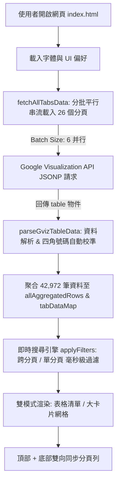

# 外文姓名譯名查詢系統 — 專案記憶與技術交接手冊 (Project Memory)

> **給接手 AI 的備忘**：這是一份為接手 AI 與開發者準備的完整專案記憶檔案。請在開始任何修改或對話前閱讀本文件，以確保理解此系統的架構、資料庫結構、歷史演進與業務編碼規則。

---

## 📌 1. 專案基本資訊 (Project Overview)

- **專案名稱**：外文姓名、中譯名與四角號碼全庫查詢系統 (`trans_name`)
- **應用定位**：專為圖書館編目、採編與讀者服務打造的高效能單頁 Web 查詢系統（Single-Page Application），直接連線 Google 試算表串流全庫資料，無需架設後端資料庫伺服器。
- **本機路徑**：`D:\antigravity\test\trans_name`
- **GitHub 倉庫**：[https://github.com/jillytsai/trans_name](https://github.com/jillytsai/trans_name)
- **線上運行網址 (GitHub Pages)**：[https://jillytsai.github.io/trans_name/](https://jillytsai.github.io/trans_name/)
- **所屬入口網**：`D:\antigravity\test\portal\index.html`（卡片 #12）

---

## 📊 2. 資料庫與 Google Sheets 架構 (Database Architecture)

### 2.1 試算表來源資訊
- **最新試算表 ID (`SPREADSHEET_ID`)**：`1DprJwhRdYzm_5icKpEAEZ1pOO-v22eCNrJi1EWfj9HA`
- **線上 Google 試算表網址**：[開啟 Google 試算表](https://docs.google.com/spreadsheets/d/1DprJwhRdYzm_5icKpEAEZ1pOO-v22eCNrJi1EWfj9HA/edit)
- **權限設定**：知道連結的任何人可檢視（Viewer）
- **總收錄規模**：**42,972 筆**外文譯名記錄（橫跨 26 個子工作表 A ~ Z）
- **資料版本**：2026-09-22 匯入 `譯名錄_輔大字典修正版_全26分頁.xlsx`（依輔大四角號碼查詢台逐筆核對修正，見第 8 節）
- **欄位格式**：
  1. `英文名稱`（例如：`Aagesen`, `Sand`, `Qabus`）
  2. `中文名稱`（例如：`阿格森`, `桑德`, `卡巴斯`）
  3. `四角號碼`（例如：`7144`, `7724`, `2174`）

### 2.2 全 26 個分頁最新真實 GID 對照表 (`ALL_SHEET_TABS`)
> ⚠️ **重要經驗**：Google Sheets 在「建立副本」或「匯入工作表」時會重新隨機生成 GID。若 GID 錯誤，Google GViz API 會**自動退回載入第一個分頁（A 分頁）**。以下為 2026-09-22 匯入「輔大字典修正版」後重新取得並實測驗證的 GID（每次「取代試算表」匯入後都要重抓，可從 `https://docs.google.com/spreadsheets/d/<ID>/htmlview` 的原始碼取得）：

| 分頁代碼 | 工作表 GID | 資料筆數 | 首筆資料範例（英文 / 中文 / 號碼） |
| :---: | :---: | :---: | :--- |
| **A** | `424640430` | 2,332 | `Aagesen` / `阿格森` / `7144` |
| **B** | `1136657273` | 4,272 | `Baader` / `巴德爾` / `7721` |
| **C** | `123272442` | 2,824 | `Caanano` / `卡瑪紐` / `2112` |
| **D** | `2067195655` | 2,247 | `D'Adamo` / `德阿達摩` / `2473` |
| **E** | `683924894` | 1,028 | `Eachard` / `厄傑德` / `7122` |
| **F** | `794016945` | 1,540 | `Fabbri` / `法布里` / `3446` |
| **G** | `77535945` | 2,410 | `Gaardar` / `賈德` / `1024` |
| **H** | `644627973` | 2,471 | `Ha` / `哈` / `6806` |
| **I** | `1686769862` | 413 | `Iacoboni` / `亞科波尼` / `1023` |
| **J** | `1620780924` | 696 | `Jaabari` / `賈巴瑞` / `1071` |
| **K** | `199925572` | 2,292 | `Ka` / `卡` / `2123` |
| **L** | `558676` | 2,233 | `L'Allemand` / `拉爾曼` / `5016` |
| **M** | `2090279865` | 3,426 | `Ma` / `馬` / `7132` |
| **N** | `753101683` | 864 | `Naaman` / `納曼` / `2460` |
| **O** | `1401084687` | 736 | `Oades` / `歐狄斯` / `7744` |
| **P** | `429884165` | 2,142 | `Pa Paioannon` / `巴巴亞農` / `7771` |
| **Q** | `574342897` | 124 | `Qabus` / `卡巴斯` / `2174` |
| **R** | `1760459755` | 1,889 | `Ra Anan` / `拉安南` / `5034` |
| **S** | `1441739257` | 4,092 | `Saade` / `薩德` / `4424` |
| **T** | `1308550539` | 1,663 | `Taaffe` / `塔菲` / `4444` |
| **U** | `415092163` | 242 | `Ubac` / `烏巴克` / `2774` |
| **V** | `931611921` | 926 | `Vaca` / `瓦加` / `1046` |
| **W** | `5374172` | 1,288 | `Waage` / `佛格` / `2547` |
| **X** | `674271756` | 18 | `Xaio` / `查艾奧` / `4042` |
| **Y** | `1344706558` | 270 | `Yaacob` / `雅可布` / `7014` |
| **Z** | `903847743` | 534 | `Zababakhin` / `札巴巴金` / `4277` |

---

## ⚙️ 3. 技術架構與資料流 (Technical Architecture)



### 3.1 跨域資料擷取 (JSONP Streaming)
- **為什麼不用 `fetch()`**：瀏覽器在開啟本地檔案 (`file:///`) 或部分跨網域環境時，會被 CORS 安全原則攔截。
- **解決方案**：透過動態 `<script>` 標籤注入呼叫 Google Visualization JSONP 端點：
  `https://docs.google.com/spreadsheets/d/${sheetId}/gviz/tq?tqx=responseHandler:${callbackName}&headers=1&gid=${gid}`
- ⚠️ **必須加 `headers=1`**：未指定時 GViz 會自行猜測標題列數，C、T 分頁曾被誤判而把前 1,500 列左右併入欄位標題（網頁只讀到 C 1,321 筆、T 255 筆）。加上後標題改由 `table.cols[].label` 提供，`parseGvizTableData` 只取有標題的欄位。
- **批次載入機制**：全 26 分頁以 `BATCH_SIZE = 6` 批次發送請求，載入速度約 1~2 秒，並在畫面頂部呈現實時進度條。

---

## 📚 4. 核心業務邏輯：圖書館外文譯名取碼規則 (Cataloging Rules)

### 4.1 著者號取碼原則（王雲五四角號碼）
> ⚠️ **關鍵規則**：**外文譯名最多只取前 3 個中文字，第 4 字及以後不納入取碼！**

1. **第 1 字為「桑」**（例如：`桑巴`、`桑德`、`桑斯特`）：
   - 第 1 字取 2 碼（左上、右上），「桑」字上方為「又又又」（雙叉），**前兩碼必為 `77`**。
   - 原表中常誤植或 OCR 為 `17xx`，自動校正為 `77xx`。
2. **第 2 字為「桑」**：
   - **2 字名**（如 `艾桑`、`布桑`、`杜桑`）：第 2 字取 2 碼（`77`），**後兩碼必為 `77`**（例如 `4417` ➔ `4477`）。
   - **3 字以上名**（如 `亞桑傑`、`阿桑傑夫斯基`）：第 2 字取 1 碼（`7`），對應**第 3 位數**。若為 `1` 則修正為 `7`（例如 `1012` ➔ `1072`、`7112` ➔ `7172`）。
3. **第 3 字為「桑」**（例如：`艾傑桑德`、`艾雪桑`、`艾力桑德遜`、`阿瑪桑`、`維拉桑塔`）：
   - 第 3 字取 1 碼（`7`），對應**第 4 位數（尾碼）**。若為 `1` 則修正為 `7`（例如 `4421` ➔ `4427`、`4411` ➔ `4417`、`4441` ➔ `4447`、`7111` ➔ `7117`、`2051` ➔ `2057`）。
4. **第 4 字及以後為「桑」**（例如：`沙克瑞桑`、`史利尼瓦桑`）：
   - **不變動！保持原號碼**（如 `沙克瑞桑` 保持 `3941`，末碼 `1` 代表第 3 字「瑞」的王字旁，第 4 字「桑」不取碼）。

---

## 🖥️ 5. 核心 UI / UX 功能清單

1. **📚 全庫跨分頁即時搜尋**：
   - 預設模式為「📚 全部分頁 (4 萬筆)」，支援中英文模糊全文比對、多關鍵字以空白分隔搜尋。
   - 搜尋字詞以黃色螢光標記（Highlight）。
2. **🔤 A - Z 快速分頁切換**：
   - 頂部導覽列提供 A 到 Z 共 26 個字母分頁按鈕，點擊可快速過濾該字母分頁。
3. **📊 4 大即時統計指標卡片**：
   - 總資料庫筆數（42,972 筆）、目前符合筆數、當前分頁筆數、已載入分頁數（26/26）。
4. **🔄 雙檢視模式**：
   - **表格清單模式 (Table View)**：清晰對比排版，含分頁標籤、英文原名、中文譯名與紫色四角號碼徽章。
   - **大卡片網格模式 (Card Grid View)**：適合大螢幕瀏覽，呈現卡片式資訊。
5. **⬆️⬇️ 上下雙向同步分頁控制列**：
   - 在表格上方與下方**皆有**分頁控制列（每頁筆數切換：20 / 50 / 100 / 200 / 全部，以及第一頁、上一頁、頁碼、下一頁、最後一頁）。
   - 頂部與底部的操作完全雙向連動同步。
6. **👁️ 自由調整字體大小**：
   - 提供 `預設` / `大字體` / `特大` 三段式縮放切換，並自動記憶於 `localStorage`。
7. **📁 匯出與明細功能**：
   - 支援將查詢結果匯出為 **CSV** 或 **JSON** 檔案，支援點選彈出視窗並一鍵複製單筆資料。

---

## 📁 6. 專案檔案清單與說明

```text
D:\antigravity\test\trans_name\
├── index.html                           # 主查詢系統單頁應用程式 (HTML5 + Tailwind + FontAwesome + JS)
├── README.md                            # 專案公開說明文件與部署指南
├── PROJECT_MEMORY.md                    # 本專案記憶與技術交接手冊 (當前檔案)
├── 譯名錄_已修正四角號碼_全26分頁.xlsx   # 完整 26 分頁 Excel 檔 (已修正 191 筆「桑」字號碼)
├── 外文姓名譯名_完整備份.xlsx            # 2026-09-21 14:57 從 Google Sheets 匯出的原始原檔備份
└── trans_name_backup.xlsx               # 本地備份副本
```

---

## 🚀 7. 部署與版本控制 (Deployment)

- **Git 分支**：`main`
- **GitHub 部署方式**：GitHub Pages 自動部署 `main` 分支根目錄 `/`。
- **推送指令**：
  ```bash
  git add .
  git commit -m "commit message"
  git push origin main
  ```
- **線上網址**：`https://jillytsai.github.io/trans_name/`

---

## 🔍 8. 四角號碼全庫核對紀錄（2026-09-22）

- **取碼規則**：1 字取 4 碼；2 字各取上兩角；3 字以上只取前 3 字（第 1 字 2 碼、第 2、3 字各 1 碼）。桑、朵上兩角皆取 `77`。
- **核對字典**：輔仁大學圖書館採編組四角號碼查詢台（http://140.136.208.5/4codes/4codes.asp）。已離線保存 13,042 字於 `四角號碼查詢/fc_data.js`，輔大未收錄的異體字（廸、啓、琼、兹…）以 Unicode Unihan `kFourCornerCode` 補判。
- **修正結果**：號碼 449 格（朵 13、依輔大取法 310〔賴、本、懷、卻、沛、豐〕、單碼誤植 92、多碼不符 34），中文 3 格（雅廸嘉、廸爾金、慕廸爾 → 迪）。明細見 `核對報告/輔大字典修正清單.xlsx`。
- **注意**：迪 (3530) 與 廸 (1540) 取法不同，不可混用。
- **待辦**：34 筆「多碼不符」建議對照原書確認中文譯名；74 筆無號碼或非譯名（說明文字、「同 Xxx」參照、`3124a` 等格式錯誤）未處理；C 分頁 D 欄有 2 個無標題的零星數值（Christensen 4043、Claire 4011）。
- **本地查詢工具**：`四角號碼查詢/index.html`，離線使用，提供著者號取碼、單字查詢、批次取碼、號碼反查。
